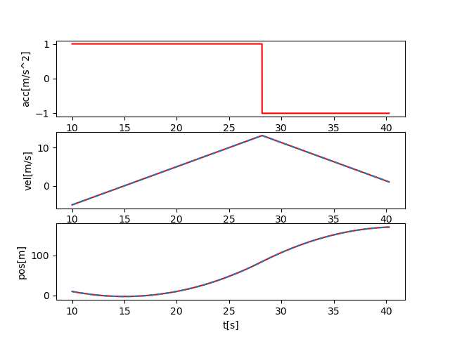
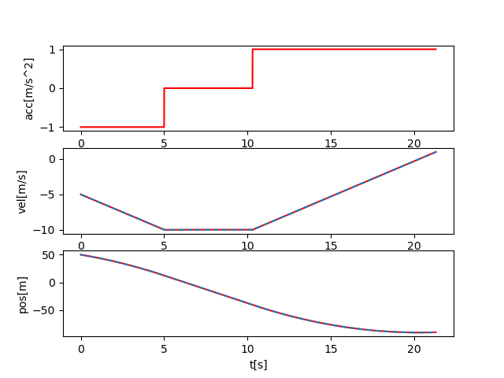

# Two Points Interpolation Python

Calculate optimal trajectory (position, velocity, acceleration) between two points with kinematic constraints.

## Overview

This library provides two trajectory planning algorithms:
1. **Constant Acceleration**: Generates smooth trajectories with acceleration limits
2. **Constant Jerk**: Generates even smoother trajectories with jerk (acceleration derivative) limits


## Installation

### From PyPI (when published)

```bash
pip install two-point-interpolation
```

### From Source

```bash
git clone https://github.com/yuokamoto/two_points_interpolation_py.git
cd two_points_interpolation_py
pip install -e .
```

### For Development

```bash
git clone https://github.com/yuokamoto/two_points_interpolation_py.git
cd two_points_interpolation_py
pip install -e ".[dev]"
```

## Quick Start

### Constant Acceleration

```python
from two_point_interpolation import TwoPointInterpolation

# Create interpolator
interp = TwoPointInterpolation()

# Set start, end, and constraints
interp.init(p0=0.0, pe=100.0, acc_max=2.0, vmax=10.0, dec_max=4.0)

# Calculate trajectory
total_time = interp.calc_trajectory()

# Get state at any time
pos, vel, acc = interp.get_point(t=5.0)
```

### Constant Jerk

```python
import two_point_interpolation_constant_jerk as tpi

interp = tpi.TwoPointInterpolationJerk()
interp.init(p0=0.0, pe=100.0, amax=2.0, vmax=10.0, jmax=1.0)

total_time = interp.calc_trajectory()
pos, vel, acc, jerk = interp.get_point(t=5.0)
```

## Examples

Run example scripts to see visualizations:

```bash
# Basic constant acceleration
python3 examples/example_constant_acc.py

# Constant jerk (smoother)
python3 examples/example_constant_jerk.py
```

## Testing

```bash
# Run all tests
python3 -m pytest tests/ -v
```

## Project Structure

```
two_points_interpolation_py/
├── two_point_interpolation_constant_acc.py   # Acceleration-based planning
├── two_point_interpolation_constant_jerk.py  # Jerk-based planning
├── examples/                                  # Example scripts
├── tests/                                     # Unit tests 
├── images/                                    # Generated plots
└── docs/                                      # Documentation
    ├── CONSTANT_ACC_DERIVATION.md            # Mathematical details
    ├── QUADRATIC_COEFFICIENTS_DERIVATION.md  # Quadratic solution derivation
    └── CHANGELOG.md                           # Version history
```

## Example Results

### Case 0: vmax not reached


**Parameters**: `t0=1.0, p0=5, pe=15, acc_max=2.0, dec_max=3.0, vmax=10.0, v0=0, ve=0`

Trajectory when the peak velocity is below vmax. Shows two phases: acceleration and deceleration.

### Case 1: vmax reached


**Parameters**: `t0=0, p0=0, pe=50, acc_max=2.0, dec_max=4.0, vmax=8.0, v0=2.0, ve=1.0`

Trajectory when vmax is reached. Shows three phases: acceleration, constant velocity, and deceleration.

## Documentation

- **Getting Started**: This README
- **Mathematical Derivation**: [docs/CONSTANT_ACC_DERIVATION.md](docs/CONSTANT_ACC_DERIVATION.md)
- **Detailed Coefficient Derivation**: [docs/QUADRATIC_COEFFICIENTS_DERIVATION.md](docs/QUADRATIC_COEFFICIENTS_DERIVATION.md)
- **Change History**: [docs/CHANGELOG.md](docs/CHANGELOG.md)

## TODO
- Constant jerk update to support acc_max != dec_max

## Requirements

- Python 3.6+
- NumPy
- Matplotlib (for examples)

## License

See [LICENSE](LICENSE) file.

